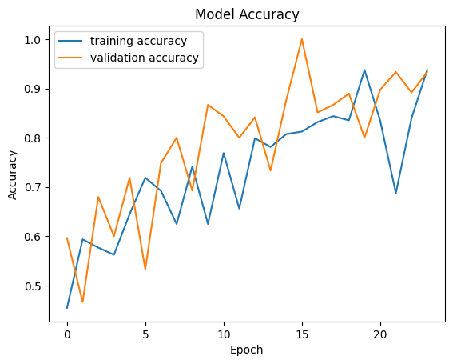
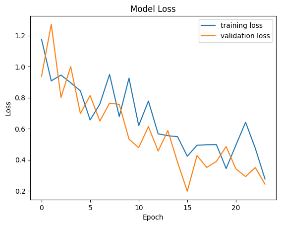

# Image Classification with TensorFlow: Training & Model Conversion (SavedModel, TFLite, TFJS)

## Introduction

This project demonstrates how to train an image classification model using TensorFlow and convert it to different formats:

- **SavedModel**: For server-side use.
- **TFLite**: For mobile or edge devices.
- **TFJS**: For browser-based use.

this project belongs to Dicoding submission on [Belajar Pengembangan Machine Learning](https://www.dicoding.com/academies/185/corridor) course.

## Dataset

I used the [Animal-10](https://www.kaggle.com/datasets/alessiocorrado99/animals10)
dataset, which contains images from Animal pictures of 10 different categories. The data is split into training and test set (80:20).

## Model Architecture

I used a Convolutional Neural Network (CNN) built with TensorFlow Keras. The model includes convolutional layers, pooling layers, dropout layers, flatten layer, and a fully connected layers.

## Training

The model was trained with the following parameters:

- **Optimizer**: Adam
- **Loss**: Categorical Cross-Entropy
- **Learning Rate**: 0.001

## Results

### accuracy plot

### loss plot

